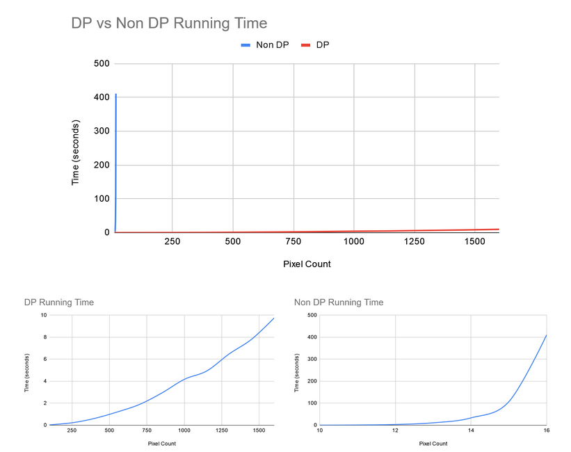

# BestSeam
This program is used to compute the best seam to remove from an image. A seam is a line of connected pixels (whose difference in position is no greater than one pixel). This is useful when compressing the image. The seam of most unsignficant pixels are removed in order for the image to retain the most detail. It is implemented using Dynammic Programming in which the best vertical seam is calculated using the function *DP[i, j] = min(DP[i − 1, j − 1], DP[i, j − 1], DP[i + 1, j − 1]) + energy(i, j)* and removed from the image. [Seam Carving Video](https://www.youtube.com/watch?v=6NcIJXTlugc)

## Package Installation:
- python3 -m pip install --upgrade pip
- python3 -m pip install --upgrade Pillow

## Files:
- resizeable_image.py: Calculates the best seam of the current image using DP
- imagematrix.py: Utility functions that help with the manipulation of images
- test_resizeable_image.py: Unit tests to test speed of implementation
- gui.py: Graphical interface that lets you see the effect of seam removal!
- sunset_small.png and sunset_full.png: Sample images used in the unit test suite

### Explaination
- [Seam Carving for Content-Aware Image Resizing](http://graphics.cs.cmu.edu/courses/15-463/2012_fall/hw/proj3-seamcarving/imret.pdf)
- Whenever a pixel is encountered, the next pixel of the seam can be one of three options, the pixel directly below it, the pixel to the right of that pixel, or the pixel to the left of that pixel. The seam would choose the minimum seam energy of the three pixels.

- It can be seen that the non-DP algorithm grows exponentially with each additional pixel. It would be near impossible for it to compute images of larger size. The DP algorithm on the other hand is able to quickly compute the best seam for images of much larger size. The running time for the DP algorithm doesn’t grow as fast as the non DP algorithm and is O(mn) compared to the exponential growth of the non-DP. One should also note that with each recursive call, there is a lot of memory overhead. The same computations are made multiple times. However in the DP algorithm, memoization is used in the DP table and calling an index takes constant time, therefore shrinking the running time. 
